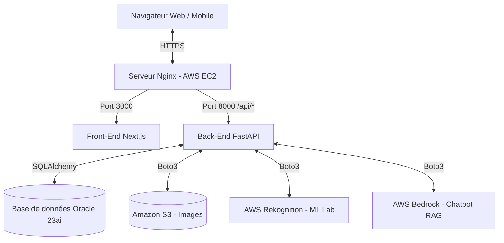

# Architecture & Structure du Projet Portfolio

Ce document explique l'organisation technique du projet "Portfolio Berthoni", du développement local jusqu'au déploiement final sur AWS, avec un focus particulier sur la base de données Oracle.

## 🏗️ 1. Architecture Générale

Le projet suit une architecture moderne "Decoupled" (découplée), où le Front-End et le Back-End sont deux applications distinctes qui communiquent via des API REST.

---

## 💻 2. Structure des Dossiers Locaux

Le dossier principal `portfolio-berthoni` est divisé en deux grands répertoires :

### `src/` (Le Front-End - Next.js)
Gère l'interface utilisateur, le design, et les animations.
- `app/` : Contient toutes les pages du site basées sur le système de "App Router" de Next.js (ex: `page.tsx` pour l'accueil, `projets/page.tsx`, `lab/page.tsx`, `admin/page.tsx`).
- `components/` : Composants réutilisables (Navbar, Chatbot, EmotionDetector, ParticlesCanvas).
- `globals.css` : Le système de design global (variables CSS, thèmes sombres/clairs, animations).
- `hooks/useAnalytics.ts` : Script personnalisé pour envoyer les clics et vues vers la base de données de manière transparente.

### `backend/` (Le Back-End - FastAPI Python)
Gère la logique métier, la sécurité, l'IA et la connexion à Oracle.
- `main.py` : Le point d'entrée du serveur API et la configuration des CORS (qui a le droit d'appeler l'API).
- `models.py` : La définition exacte des "Tables" de la base de données Oracle (via SQLAlchemy).
- `database.py` : Le script qui orchestre la connexion pure vers le moteur Oracle distant.
- `routers/` : Les sous-API catégorisées (`projects.py`, `analytics.py`, `emotion.py`, `rag.py`).
- `services/s3_service.py` : La logique d'upload des images vers ton bucket Amazon S3.
- `auth.py` : La sécurité par Token JWT (JSON Web Token) pour bloquer l'accès au tableau de bord administrateur (chiffrement bcrypt).

---

## 🛢️ 3. Modélisation de la Base de Données (Oracle 23ai)

La base de données relationnelle est l'épine dorsale du site. Plutôt que d'avoir du code statique en dur, toutes tes données vivent dans Oracle.

### A. La Table `projects` (La table centrale)
Stocke tous tes travaux.
- `id` (Clé primaire)
- `title` / `description` / `content` : Textes.
- `tags` : Séparés par des virgules (ex: "Python, AWS").
- `github_url` / `powerbi_url` / `demo_url` / `thumbnail_s3` : Les liens externes.

### B. La Table `analytics` (Trafic et KPIs)
C'est ici que finissent les données du dashboard administrateur.
- `id` (Clé primaire)
- `event_type` : Le type d'action (ex: `page_view`, `lab_view`, `cv_download`).
- `target_id` : Si l'action concerne un projet spécifique (ID du projet).
- `ip_hash` : L'empreinte anonymisée du visiteur pour compter les visiteurs "uniques".
- `timestamp` : Date et heure exacte.

### C. La Table `project_comments` & `project_likes`
Les interactions sociales. Reliées (Foreign Key) à la table `projects`.
- Stockent les textes des commentaires et le `ip_hash` des likes pour empêcher quelqu'un de liker 2 fois.

### D. La Table `contact_messages`
C'est ton carnet d'adresses. Quand quelqu'un remplit le formulaire de contact du site, le message fini ici à l'abri pour que tu puisses le lire depuis ton admin.

---

## 🌐 4. Infrastructure de Déploiement (AWS)

Le site vit sur une machine **Amazon Web Services (AWS EC2)**.

1. **Le Reverse Proxy (Nginx) :** 
   Nginx est le gardien à la porte (Port 80/443). Il prend toutes les requêtes qui arrivent sur `https://berthonipassoportfolio.com`.
   - Si la route est `/api/...`, il redirige discrètement vers le port interne `8000` (FastAPI).
   - Sinon, il redirige vers le port interne `3000` (Next.js).

2. **La Sécurité SSL/HTTPS (Certbot) :**
   Il fournit le "cadenas vert". Obligatoire pour utiliser des fonctions web modernes comme l'accès à la Webcam (pour l'Emotion Detector).

3. **La Persistance (nohup) :**
   Les outils `nohup` (`nohup npm start &` et `nohup uvicorn... &`) permettent à tes deux serveurs (Node.js et Python) de continuer à tourner indéfiniment en arrière-plan, même quand tu fermes ta fenêtre SSH PuTTY/Terminal.

---

## 🔒 5. Sécurité

Le site implémente plusieurs couches de défense :
- **Rate Limiting (SlowAPI)** : Le backend bloque les requêtes automatisées abusives (max 60/minute pour la page de connexion) pour empêcher les attaques par force brute.
- **CORS Stricts** : Seul ton nom de domaine `berthonipassoportfolio.com` est autorisé à interroger la base de données.
- **Validation Pydantic** : Le backend vérifie scrupuleusement la longueur (max_length) des commentaires et formulaires avant de les écrire dans Oracle, empêchant les injections SQL ou les crashs mémoires.
- **Séparation des Médias** : Oracle ne stocke que du texte. Les images des projets sont expédiées chez `Amazon S3`, ce qui garde la base de données ultra-rapide et légère.
